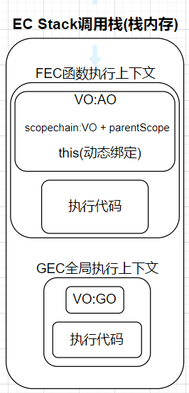

# this前言

## 为什么使用this

从某种角度来说，开发中如果没有this，很多问题也是有解决方案的

**但是如果没有this，会让我们编写代码变得非常不方便**

## this指向什么

**this在浏览器中的全局作用于下指向什么？**

* 非常简单，是window

但是，开发中很少直接在全局作用于下去使用this，通常都是在函数中使用

* 所有的函数在被调用时，都会创建一个执行上下文，这个上下文中记录着函数的调用栈、AO对象等
* this也是其中的一条记录

 

**this在Node.js中的全局作用于下指向什么？**

* 指向空对象——{  }