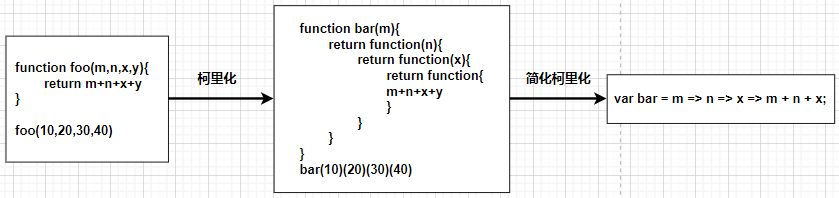
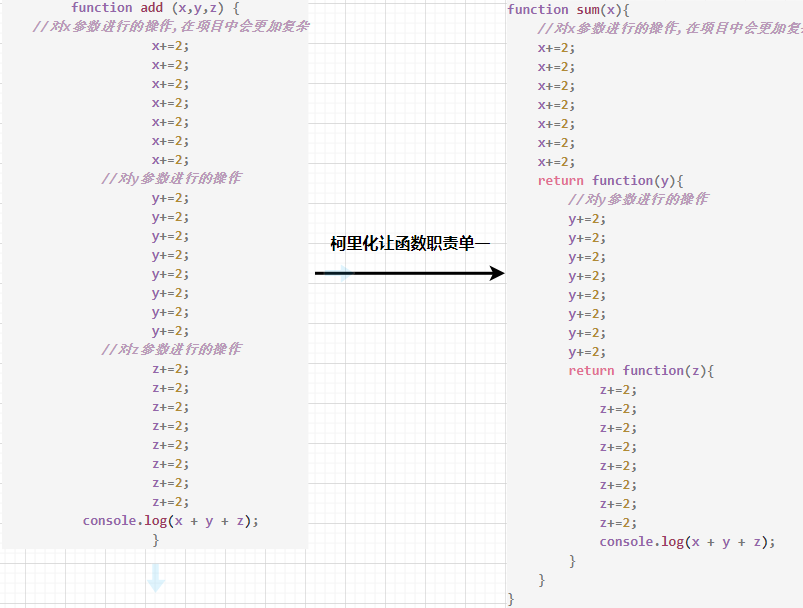
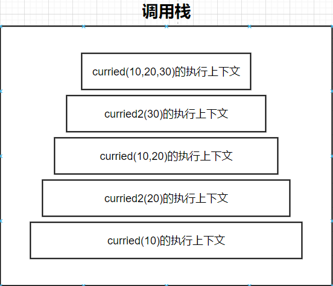

# 认识柯里化

**柯里化也是属于函数式编程里面一个非常重要的概念**


## 什么是柯里化（Currying）

我们先来看一下维基百科的解释

* 在计算机科学中，柯里化（英语：Currying），又译为卡瑞化或加里化
* 是把接收多个参数的函数，变成接受一个单一参数（最初函数的第一个参数）的函数，并且返回接受余下的参数，而且返回结果的新函数的技术
* 柯里化声称 “如果你固定某些参数，你将得到接受余下参数的一个函数”


维基百科的结束非常的抽象，我们这里做一个总结

* 只传递给函数一部分参数来调用它，让它返回一个函数去处理剩余的参数,这个过程就称之为柯里化
  


## 柯里化有什么作用？

### 让函数的职责单一

在函数式编程中，我们其实往往希望一个函数处理的问题尽可能的单一，而不是将一大堆的处理过程交给一个函数来处理

* 那么我们是否就可以将每次传入的参数在单一的函数中进行处理，处理完后在下一个函数中再使用处理后的结果
  


### 帮助我们可以复用参数逻辑

1. ```javascript
function sum(x,y) {
    return x + y;
}
sum(10,20)
sum(10,30)
sum(10,40)


2. ```javascript
var sum2 = x => y => x + y;
let add10 = sum2(10);
add10(20)
add10(30)
add10(40)

* 第一个代码一直复用10作为第一实参,这实在太过麻烦，可以直接使用柯里化复用参数逻辑变成第二个代码


## 柯里化的实现

```javascript
function hyCurring(fn) {
    function curried(...args) {
        //判断第一次调用的时候传入的实参个数是否等于被柯里化的函数的形参个数
        if(fn.length === args.length){
            return fn(...args);
        }
        //如果不满足,则创建一个新的函数来接收剩下的实参
        else{
            function curried2(...args2) {
                curried(...args, ...args2)
            }
            return curried2
        }
    }
    return curried
}
```

原理:


* 可以看出curried2的作用就是接受剩余实参,然后再传给curried执行,递归就是为了让curried2在满足递归条件之前,可以一直接收剩余实参