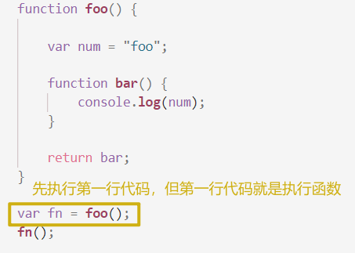

# 闭包的注意事项

## 闭包会造成内存泄漏,形如下面的代码:

```javascript
function foo() {

    var num = "foo";

    function bar() {
        console.log(num);
    }

    return bar;
}

var fn = foo();
fn();
```

> 让我们来思考一下:根据认识作用域的描述，在'var fn = foo();'这行代码执行后，在'fn();'执行之前,foo()的AO(Active Object)私有变量对象理应来说应该销毁,但为什么'fn();'执行的时候还是能访问到foo函数的自由变量呢?

**分析过程**

​	先按照时间线来划分:

1. `开始编译时:`
2. `编译结束,开始执行代码:`
3. `代码开始执行后遇到函数被调用,但在执行函数之前:`
4. `开始执行函数内代码:`
5. `函数执行结束:`

<br/>

### `开始编译时:`


### `编译结束,开始执行代码:`




### `代码开始执行后遇到函数被调用,但在执行函数之前:`


### `开始执行函数内代码:`


### `函数执行结束:`


#### 以上就是结合JavaScript编译过程来分析闭包

---
<br/>
<br/>
**总结:**函数执行完,被消除的其实是函数的函数执行上下文,而真正存储函数里的对象信息的是AO,只是普通函数的VO被销毁后,根目录中没有东西再指向AO,所以AO随后被销毁掉

但闭包之后,从根目录出发,是有箭头指向foo函数的AO对象的:


* 所以foo函数的AO对象不会被销毁掉,所以bar函数可以自由使用父级定义域(parentScope)中的自由变量
* 但是我们来研究一个问题：AO对象不会被销毁时，是否里面的所有属性都不会被释放？
  * 如果AO对象中有部分属性没有被调用到,在V8引擎中,会对这些没有被调用到的进行一个性能优化——即把它们销毁掉