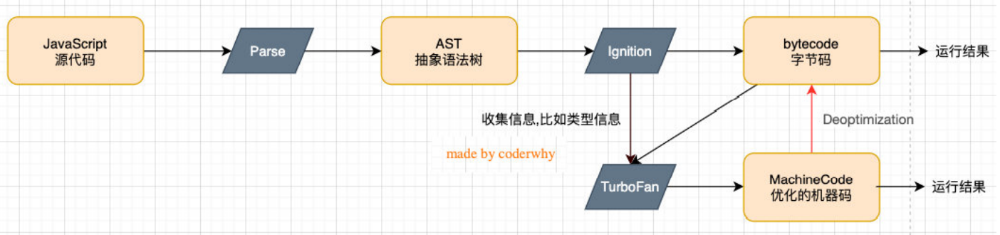
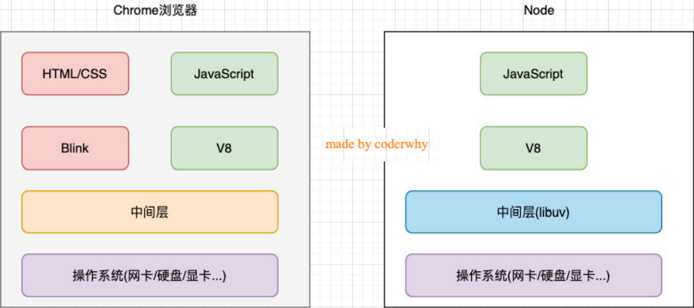
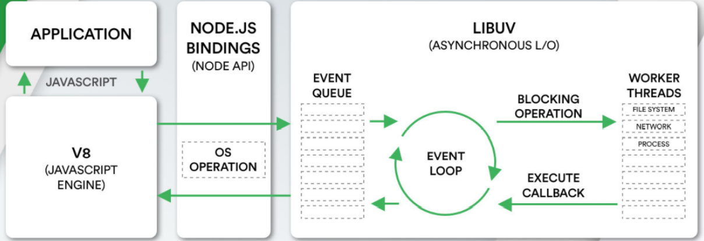

# 为什么学习Node

## 什么是Node.js呢?

**Node.js是一个基于V8 JavaScript引擎的JavaScript运行时环境。**

这时候我们可能会问:

* 什么是JavaScript运行环境呢?
* 为什么JavaScript需要特别的运行环境呢?
* 什么是JavaScript引擎?

先回答什么是JavaScript引擎

* 将汇编语言转换为机器语言即:0101010

为什么需要JavaScript引擎呢？

* 事实上我们编写的JavaScript无论你交给浏览器或者Node执行，最后都是需要被CPU执行的
* 但是CPU只认识自己的指令集，实际上是机器语言，才能被CPU所执行
* 所以我们需要JavaScript引擎帮助我们将JavaScript代码翻译成CPU指令来执行

比较常见的JavaScript引擎有哪些呢？

* SpiderMonkey

  >第一款JavaScript引擎，由Brendan Eich开发（也就是JavaScript作者）

* Chakra

  >微软开发，用于IT浏览器

* JavaScriptCore

  >WebKit中的JavaScript引擎，Apple公司开发

* **V8**

  >Google开发的强大JavaScript引擎，也帮助Chrome从众多浏览器中脱颖而出

  * 什么是V8？

    >* V8是用C ++编写的Google开源高性能JavaScript和WebAssembly引擎，它用于Chrome和Node.js等
    >* 它实现ECMAScript和WebAssembly，并在Windows 7或更高版本，macOS 10.12+和使用x64，IA-32，ARM或MIPS处理器的Linux系统上运行
    >* V8可以独立运行，也可以嵌入到任何C ++应用程序中

  * V8引擎的原理

    >V8引擎本身的源码非常复杂，大概有超过100w行C++代码
    >
    >
    >
    >* Parse模块会将JavaScript代码转换成AST（抽象语法树），这是因为解释器并不直接认识JavaScript代码
    > > * 如果函数没有被调用，那么是不会被转换成AST的
    > > * [点击跳转Parse的V8官方文档：](https://v8.dev/blog/scanner)
    >* Ignition是一个解释器，会将AST转换成ByteCode（字节码）
    >>  * 同时会收集TurboFan优化所需要的信息（比如函数参数的类型信息，有了类型才能进行真实的运算）
    > > * 如果函数只调用一次，Ignition会执行解释执行ByteCode
    > > * [点击跳转Ignition的V8官方文档：](https://v8.dev/blog/ignition-interpreter)
    >* TurboFan是一个编译器，可以将字节码编译为CPU可以直接执行的机器码
    >  >* 如果一个函数被多次调用，那么就会被标记为热点函数，那么就会经过TurboFan转换成优化的机器码，提高代码的执行性能
    > > * 但是，机器码实际上也会被还原为ByteCode，这是因为如果后续执行函数的过程中，类型发生了变化（比如sum函数原来执行的是number类型，后来执行变成了string类型），之前优化的机器码并不能正确的处理运算，就会逆向的转换成字节码
    > > * [点击跳转TurboFan的V8官方文档：](https://v8.dev/blog/turbofan-jit)
    >* 上面是JavaScript代码的执行过程，事实上V8的内存回收也是其强大的另外一个原因，不过这里暂时先不展开讨论：
    > > * Orinoco模块，负责垃圾回收，将程序中不需要的内存回收；
    > > * [点击跳转Orinoco的V8官方文档：](https://v8.dev/blog/trash-talk)

**看完以上内容,我们可以知道,Node.js是基于V8引擎来执行JavaScript代码，但不仅仅只有V8引擎**

* 前面我们知道V8可以嵌入到任何C ++应用程序中，无论是Chrome还是Node.js，事实上都是嵌入了V8引擎来执行JavaScript代码
* 但是在Chrome浏览器中，还需要解析、渲染HTML、CSS等相关渲染引擎，另外还需要提供支持浏览器操作的API、浏览器自己的事件循环等

* 另外，在Node.js中我们也需要进行一些额外的操作，比如文件系统读/写、网络IO、加密、压缩解压文件等操作

## Node执行和浏览器执行的区别

浏览器和Node.js架构区别:

我们来看一个单独的Node.js的架构图：

* 我们编写的JavaScript代码会经过V8引擎，再通过Node.js的Bindings，将任务放到Libuv的事件循环中
* libuv（Unicorn Velociraptor—独角伶盗龙）是使用C语言编写的库
* libuv提供了事件循环、文件系统读写、网络IO、线程池等等内容
* 具体内部代码的执行流程，我会在后续专门讲解事件和异步IO的原理中详细讲解